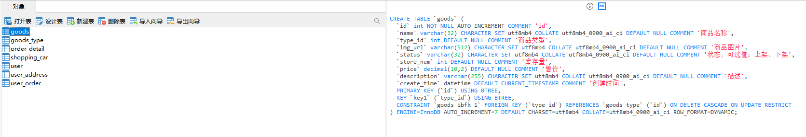

# 1 项目介绍
基于SSM+Vue的在线点餐平台：后端 SpringBoot、Mybatis-Plus，前端Vue+ElementUI，具体功能如下：
# 管理员
- 个人中心：查看和修改个人信息、修改密码
- 用户管理
- 菜品类型管理
- 菜品信息管理
- 菜品评价管理
- 订单管理
- 轮播图管理
- 在线客服

# 用户
- 首页
- 菜品信息
- 菜品资讯
- 购物车
- 在线客服
- 个人中心
# 2 系统运行截图
## 2.1 用户登录

## 2.2 菜品列表

## 2.3 菜品详情

## 2.4 购物车

## 2.5 菜品管理

## 2.6 菜品资讯

## 2.7 订单信息

## 2.8 万字文档

## 2.9 PPT

# 3 数据库设计

# 4 源码数据库获取(收费)

